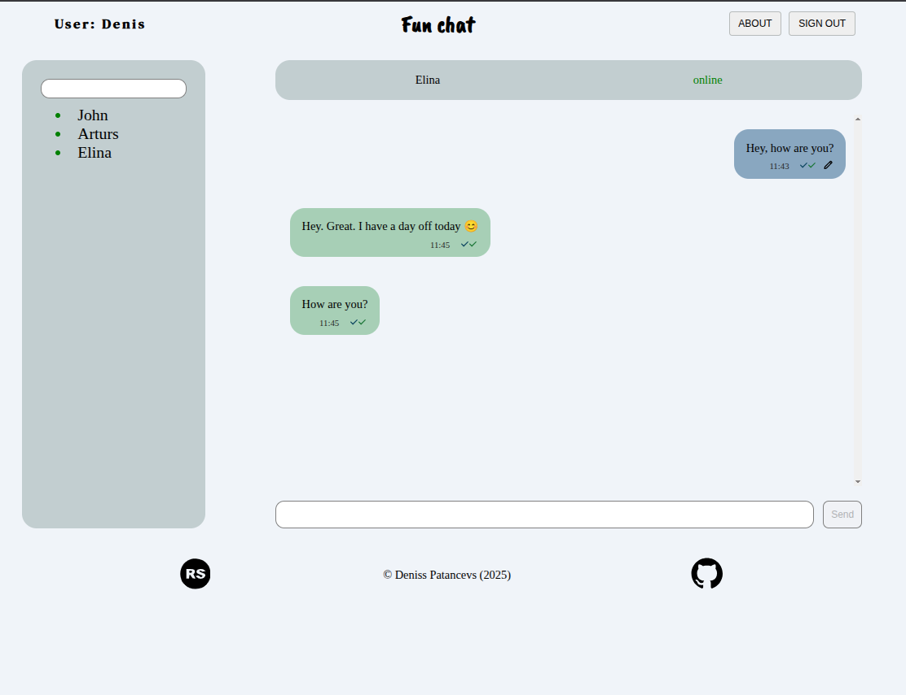

# 💬 Fun Chat

A real-time chat application built with **TypeScript**, **WebSocket**, and **modular architecture**.  
It allows users to authenticate, send and edit messages, see online statuses, and enjoy seamless real-time updates — all in a clean, responsive SPA interface.

---

## 🧩 Project Overview

**Fun Chat** is a single-page chat application where both the client and the server can initiate communication using WebSockets.  
It’s built to demonstrate real-time interactions, message synchronization, authentication, and routing without using any frontend frameworks.

### 🗝️ Key Features

- 🔐 **User Authentication:** Login and password validation with error handling.
- 💬 **Live Messaging:** Real-time chat powered by WebSocket; supports message sending, editing, and deletion.
- 👥 **User List:** Shows all registered users with online/offline indicators and unread message counts.
- 📜 **Message History:** Chronological, scrollable conversation view with read/delivered status indicators.
- 🧭 **SPA Routing:** Browser navigation works seamlessly with history, forward/back buttons, and unique URLs.
- 📱 **Responsive Design:** Fully adaptive layout from 1440px to 380px.
- 🔄 **Auto Reconnect:** Automatic reauthorization after disconnection from the server.
- 🧰 **Code Quality:** Typed with TypeScript, ESLint (Unicorn config), Prettier, and Husky Git hooks.

---

## ⚙️ Tech Stack

| Category          | Technologies                                        |
| ----------------- | --------------------------------------------------- |
| **Languages**     | TypeScript, JavaScript (ES6+), HTML, CSS / Sass     |
| **Core Concepts** | WebSocket, SPA, Modular Architecture, Routing       |
| **Build Tools**   | Webpack                                             |
| **Code Quality**  | ESLint (TypeScript + Unicorn), Prettier, Husky      |
| **Design & UX**   | Responsive Design, DOM Manipulation, Interactive UI |

---

## 🧠 Learning Goals

- Master **asynchronous JavaScript** and event-driven programming.
- Understand **WebSocket** communication where both client and server can send messages.
- Build a dynamic **SPA** with routing and state persistence.
- Improve modular code structure and clean architecture.

---

## 📸 Preview



---

## 🌐 Live Demo

🔗 [Try Fun Chat](https://deniss87.github.io/JSFEEN2024Q4/fun-chat/)

---

## 📂 Project Setup

To run the project locally, you need to start both the **frontend** and the **WebSocket server**.

### 👨🏻‍💻 1. Clone the repository

```bash
# Clone the repository
git clone https://github.com/deniss87/JSFEEN2024Q4.git

# Navigate to the repository folder
cd JSFEEN2024Q4

# Switch to the project branch
git checkout fun-chat
```

### ⚙️ 2. Start the WebSocket Server

The project requires a running **WebSocket server** to handle chat functionality.  
The server code is located in the `fun-chat-server` folder (copied from the official _Rolling Scopes School_ repository).  
Make sure the WebSocket server is running before starting the frontend, otherwise chat app will not work.  
**Use node 14.x or higher.**

```bash
# 1. Navigate to the API folder (from repository folder)
cd fun-chat-server

# 2. Install dependencies
npm install

# 3. Create the .env file and specify the port settings and server event log settings in it.
#    (you can use .env.example)

     # Linux / Mac OS
     cp .env.example .env

     # Windows
     copy .env.example .env

# 4. Start the server
npm start
```

### 💬 3. Start the Frontend Application

```bash
# Navigate to the project folder (from repository folder)
cd fun-chat

# Install dependencies
npm install

# Run the project
npm start
```
