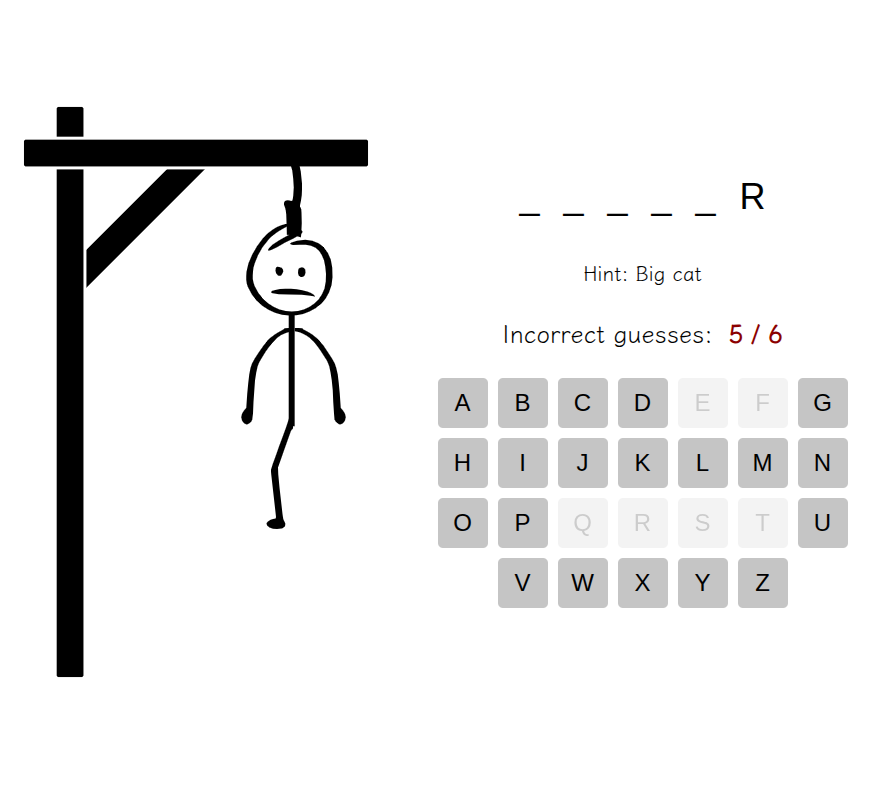

# 🎯 Hangman

## 🕹️ About the Project

**Hangman** is a classic word-guessing game built with **HTML**, **CSS (Sass)**, and **JavaScript**.  
The goal is to guess the hidden word by suggesting letters within a limited number of attempts.  
Each incorrect guess brings the character one step closer to being "hanged" — can you save them in time?

This project focuses on **DOM manipulation**, **event handling**, and **JavaScript logic** for game state management.

---

## ✨ Features

- 🔤 Dynamic word generation
- 🎨 Clean and responsive layout
- 🧠 Game logic built with vanilla JavaScript
- ⚙️ Real-time feedback on user input
- 💀 Progressive drawing of the “hangman”
- 📱 Works on both desktop and mobile devices

---

## 🧰 Tech Stack

| Technology            | Description                          |
| --------------------- | ------------------------------------ |
| **HTML5**             | Semantic and accessible structure    |
| **CSS3 / Sass**       | Responsive and maintainable styling  |
| **JavaScript (ES6+)** | Handles game logic and interactivity |
| **Responsive Design** | Optimized for all devices            |

---

## 📸 Preview



---

## 🌐 Live Demo

🔗 [Play Hangman](https://deniss87.github.io/JSFEEN2024Q4/hangman/)

---

## 📂 Project Setup

If you'd like to run this project locally:

```bash
# Clone the repository
git clone https://github.com/your-username/hangman.git

# Navigate to the project folder
cd hangman

# Open index.html in your browser
```
