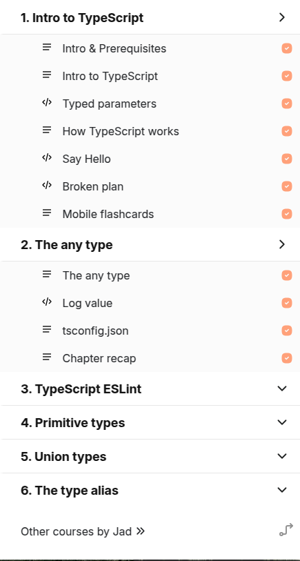
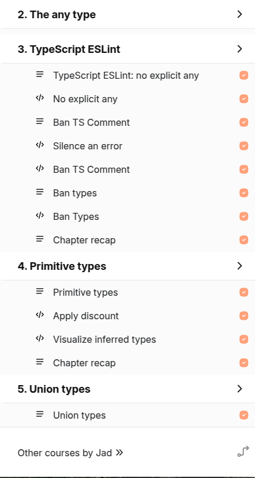

# My TypeScript Journey

## Course 'Beginner's TypeScript'

Here is my result of the course: **Сompleted** _(received a certificate)_

**Feedback:** 
On the one hand, the course is well done technically and everything is done in a virtual environment, but this is also bad because it does not tell how to set up ts locally and the tasks are quite simple and, moreover, you can skip them and immediately move on to the solution, so it is only on the student's conscience. On the one hand, they tell the very basics, but then they can suddenly show more complex things. I learned some new things, but in general, the course is quite chaotic and perhaps not suitable for a beginner course on ts.

## Course 'Learn TypeScript step by step in an interactive environment'

Here is my result of the course: **completed all free lectures** _(7/53)_

**Feedback:**
A good course, both technically and in content, it's a pity that only part of the lectures can be completed for free. I really liked the technical side, that you can save notes, flash cards, and also at the end of each lesson there is a recap. Well suited for a beginner course on ts, but also for an intermediate level (but it is paid).
 

## Reflections

Since I had already completed a couple of courses on ts ([like this one](https://www.youtube.com/watch?v=gieEQFIfgYc)), these were more like a refresher and reinforcement of skills,
but still there are a couple of new things that I learned, and I really liked the technical implementation of the second course.
